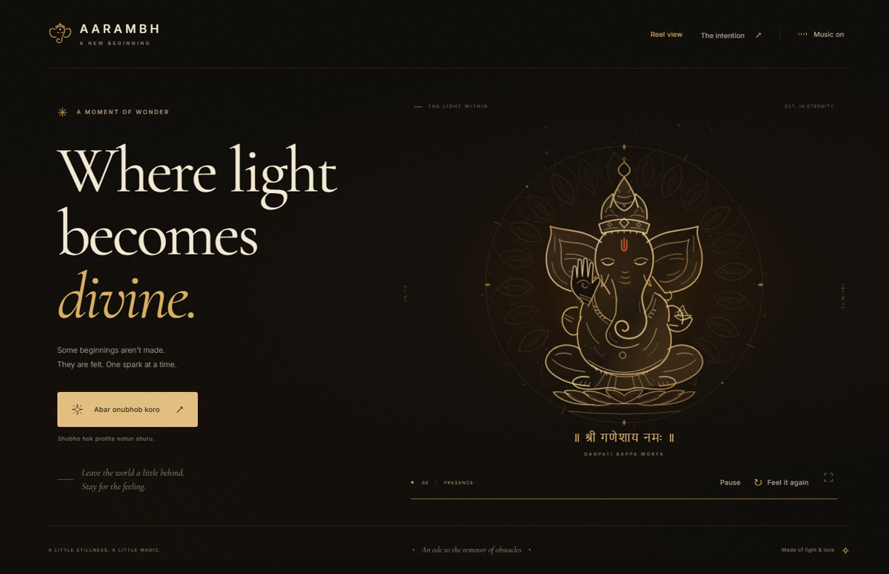

<div align="center">

# AARAMBH

### Where light becomes divine.

A cinematic Ganesh reveal, drawn with light and set to music.

**Original SVG artwork · Procedural animation · 9:16 reels · No runtime dependencies**

[Download the latest reel](exports/aarambh-ganesha-slow-orbit.mp4) · [View the cover](exports/aarambh-ganesha-slow-orbit-cover.jpg) · [Run locally](#run-locally)

</div>



Aarambh means *beginning*. This small tribute to Ganesh turns a single spark into a luminous figure: streams of light trace the crown, ears and trunk, fine particles settle into the surface, and a lotus and mandala unfold around him. Antique gold, warm black and restrained sindoor accents give the experience its quiet, devotional character.

## The experience

- **A 12.5-second reveal.** Three flowing light filaments lead the formation of the artwork, followed by a moving highlight and a blessing.
- **A slowly turning mandala.** Rotation begins at **7.5 seconds**, as the petals unfold, and eases into one clockwise turn every **80 seconds**. Ganesh stays still; masks keep the ornament behind the figure.
- **Music from the first touch.** The included *Yun Toh Mushak Sawari Teri – Deva Shree Ganesha* track starts when the experience begins. Music and motion can be paused together.
- **Small interactions.** Nearby dust responds gently to the pointer; touch adds a contained ripple while keeping page scrolling available.
- **A portrait composition.** Reel view frames the full figure and blessing in a vertical presentation. The downloadable video is 9:16.
- **Considered motion controls.** Replay, skip, pause, fullscreen, hidden-tab pause and reduced-motion preferences are supported.
- **Local assets.** Fonts, artwork and audio are served with the project. The website needs no CDN, framework, build step or runtime package installation.

## Run locally

Use **Node.js 18 or newer** for the website.

```sh
git clone https://github.com/palnirupam/Ganeshweb.git
cd Ganeshweb
npm run dev
```

Open the URL printed in the terminal, usually **http://localhost:3000**. If that port is busy, the server tries the next available port through 3020. Stop it with **Ctrl+C**.

There are no npm dependencies to install. On Windows PowerShell, use `npm.cmd run dev` if execution policy blocks `npm`.

To choose a port explicitly:

```powershell
$env:PORT = '3005'
npm.cmd run dev
```

An explicitly selected port must be available; the server will report a clear error if it is occupied.

## Controls

| Control | What it does |
| --- | --- |
| **Bappa ke jagao** / central spark | Starts the reveal and music |
| **Pause / Resume** | Freezes or resumes the scene and soundtrack |
| **Skip** | Shows the completed artwork |
| **Feel it again** | Restarts the reveal |
| **Music on / off** | Enables or mutes the soundtrack |
| **Reel view / Exit reel** | Switches between the page and portrait composition |
| **Fullscreen** | Expands the artwork, keeping playback controls accessible |
| **Escape** | Exits reel view or closes the intention dialog; fullscreen follows browser behavior |

Append `?portrait=1` to the local URL to open Reel view directly. When the system requests reduced motion, the experience shows the completed artwork without the travelling reveal or rotating mandala.

## Instagram reel

The latest export includes the early, gently rotating mandala:

| File | Details |
| --- | --- |
| [aarambh-ganesha-slow-orbit.mp4](exports/aarambh-ganesha-slow-orbit.mp4) | 18 seconds · 1080 × 1920 · 30 fps · H.264 / AAC |
| [aarambh-ganesha-slow-orbit-cover.jpg](exports/aarambh-ganesha-slow-orbit-cover.jpg) | Matching portrait cover |

The reel uses the **first 18 seconds** of the supplied track, with a soft ending fade. It holds on the completed artwork while the background continues its slow movement. Download the MP4 and select it in Instagram to upload it.

### Render your own copy

Rendering requires **Node.js 22+**, **Google Chrome**, and **FFmpeg** on `PATH`. Start the local website, then open a second terminal:

```sh
npm run render:reel -- --url http://127.0.0.1:3000 --output exports/my-reel.mp4
```

Use the actual port printed by your server. Rendering captures the full composition—SVG, Canvas particles and text—frame by frame, then combines it with the music. The output includes a matching `my-reel-cover.jpg`.

For a smaller preview:

```sh
npm run render:reel -- --url http://127.0.0.1:3000 --width 540 --height 960 --fps 24 --output exports/preview.mp4
```

For seven still frames at key moments, without encoding a video:

```sh
npm run render:reel -- --url http://127.0.0.1:3000 --width 540 --height 960 --stills 1
```

The renderer uses a separate headless Chrome profile. Its default Chrome path is the standard Windows installation; set `CHROME_PATH` to your Chrome executable on another system or installation. `FFMPEG_PATH` can override the FFmpeg executable. Preview renders, browser profiles and diagnostic screenshots stay out of Git.

## How it works

| Layer | Implementation |
| --- | --- |
| Artwork | Original SVG contours, closed bronze-toned regions and stationary overlap masks |
| Light | Canvas 2D filaments, particles, dust, ripples and selective highlights |
| Choreography | One JavaScript clock for reveal progress, mandala rotation, pause and replay |
| Sound | HTML audio with a small Web Audio warmth adjustment |
| Presentation | Responsive CSS, local Cormorant and Inter fonts, portrait and capture modes |
| Export | Chrome DevTools Protocol screenshots encoded by FFmpeg |

Capture mode (`?capture=1`) hides controls and stops realtime playback. `window.aarambh.seek(milliseconds)` renders a chosen moment, so exported frames use deterministic timing. The implementation uses Canvas and SVG; the earlier [animation design plan](docs/animation-v2-plan.md) also records alternatives considered during development.

```text
Ganeshweb/
├── index.html          Page and original Ganesh artwork
├── styles.css          Layout, typography and portrait styling
├── app.js              Animation clock, light effects and music
├── presentation.js     Portrait and capture modes
├── server.js           Local preview server
├── assets/             Local fonts and their licenses
├── docs/               Preview image and animation design notes
├── exports/            Latest reel and matching cover
└── .checks/            Browser checks and video-rendering scripts
```

## Verification

```sh
npm run check           # JavaScript syntax
npm run test:server     # Port selection and startup errors
npm run test:browser    # Browser interaction checks
```

Browser checks require **Node.js 22+**, Chrome and a running local server. They use `http://127.0.0.1:3000` by default. Set `AARAMBH_URL` when using another port; `CHROME_PATH` overrides the Chrome executable:

```powershell
$env:AARAMBH_URL = 'http://127.0.0.1:3005'
npm.cmd run test:browser
```

The checks cover desktop and mobile viewports, actual audio playback, pause/resume, resize while paused, replay, skip, fullscreen, portrait view and reduced motion. The still-frame workflow checks repeatable seeking. Mobile viewport checks do not substitute for testing on physical Android and iOS devices.

## Static hosting

Deploy these files together to a static host, preserving their relative paths:

- `index.html`, `styles.css`, `app.js`, `presentation.js`, `favicon.svg`
- The `assets/` directory
- The supplied root MP3 file, with its original filename

No build command is needed. `server.js` is for local preview. To use GitHub Pages, publish the `main` branch from `/ (root)` in the repository's **Settings → Pages**. Enable hosting separately after the code has been pushed.

## Credits

- **Soundtrack:** *Yun Toh Mushak Sawari Teri – Deva Shree Ganesha*, Ajay–Atul; supplied with the project.
- **Typography:** Cormorant and Inter. Their SIL Open Font License files are included in `assets/`.
- **Visuals:** SVG illustration and procedural light effects authored in the project source.

<div align="center">

*Ganpati Bappa Morya. May every beginning be blessed.*

</div>
